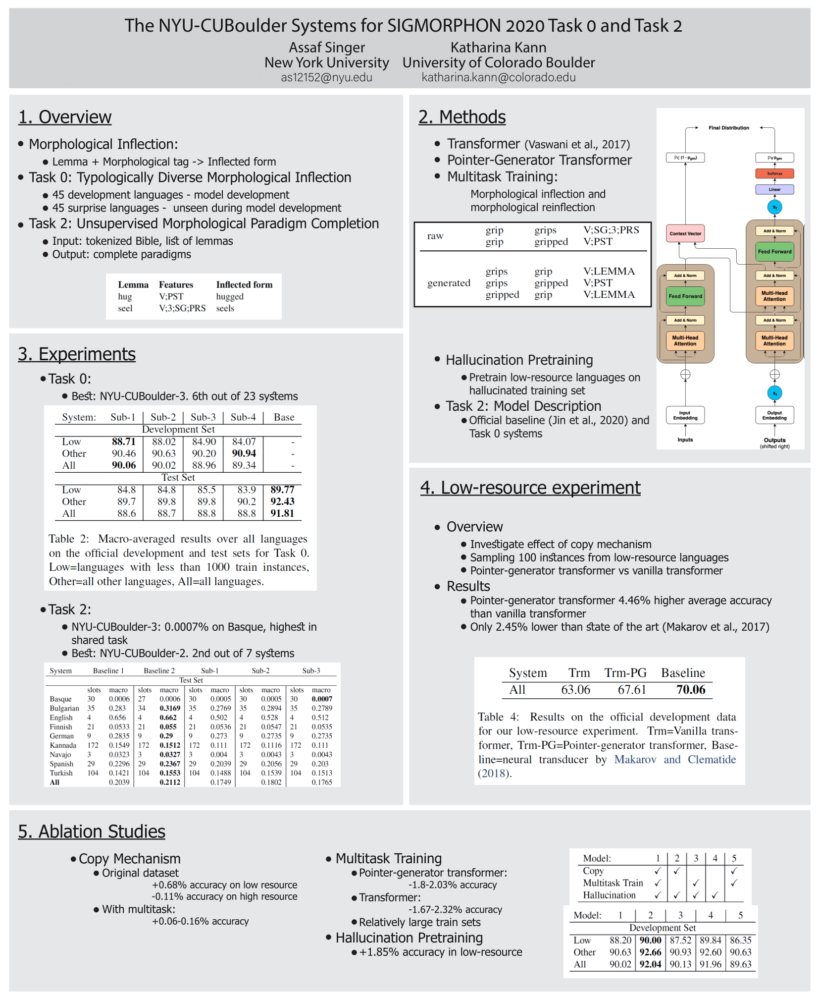

- **Task 0 Q/A**  
  **Paper:**  [SIGMORPHON 2020 Shared Task 0: Typologically Diverse Morphological Inflection](Papers/39_Paper.pdf)  
  **Zoom Link:**  
  **Chat Link:**  
  
- **Task 1 Q/A**  
  **Title:**  [The SIGMORPHON 2020 Shared Task on Multilingual Grapheme-to-Phoneme Conversion](Papers/38_Paper.pdf)  
  **Zoom Link:** [Join](https://gc-cuny.zoom.us/j/3141326339?pwd=SFl6N21xMmFacEYzdmpWRDJMbjBMUT09) 
  **Chat Link:**  
  
- **Task 2 Q/A**  
  **Paper:**  [The SIGMORPHON 2020 Shared Task on Unsupervised Morphological Paradigm Completion](Papers/37_Paper.pdf)  
  **Zoom Link:** [Join](https://cuboulder.zoom.us/j/3188371773) 
  **Chat Link:**  
  
  
  
  
  **Posters**
  
- **DeepSpin**  
  **Paper:**  [DeepSPIN at SIGMORPHON 2020: One-Size-Fits-All Multilingual Models](Papers/18_Paper.pdf)  
  **Poster:** [Download](Posters/18_Poster.pdf)  
  **Zoom Link:**  
  **Chat Link:**  
    

- **IMS**  
  **Paper:**  [Ensemble Self-Training for Low-Resource Languages: Grapheme-to-Phoneme Conversion and Morphological Inflection](Papers/19_Paper.pdf)  
  **Poster:** [Download](./Posters/19_Poster.pdf)  
  **Zoom Link:**  
  **Chat Link:**  
    
  
- **CMU-LTI**  
  **Paper:**  [The CMU-LTI submission to the SIGMORPHON 2020 Shared Task 0: Language-Specific Cross-Lingual Transfer](Papers/21_Paper.pdf)  
  **Poster:**   
  **Zoom Link:**  
  **Chat Link:**  

    
- **UZH**  
  **Paper:**  [Grapheme-to-Phoneme Conversion with a Multilingual Transformer Model](Papers/22_Paper.pdf)  
  **Poster:**   
  **Zoom Link:**  
  **Chat Link:**  
  
- **NYU-CUBoulder**  
  **Paper:**  [The NYU-CUBoulder Systems for SIGMORPHON 2020 Task 0 and Task 2](Papers/23_Paper.pdf)  
  **Poster:**  [Download](./Posters/23_Poster.pdf)  
  **Zoom Link:** [Join](https://nyu.zoom.us/j/4553539585) 
  **Chat Link:**  
    

     
- **IMS-CUBoulder**  
  **Paper:**  [The IMS–CUBoulder System for the SIGMORPHON 2020 Shared Task on Unsupervised Morphological Paradigm Completion](Papers/24_Paper.pdf)  
  **Poster:** [Download](./Posters/24_Poster.pdf)  
  **Zoom Link:**  
  **Chat Link:**  
    

  
- **ETS-Zürich**  
  **Paper:**  [SIGMORPHON 2020 Task 0 System Description: ETH Zürich Team](Papers/25_Paper.pdf)  
  **Poster:**   
  **Zoom Link:**  
  **Chat Link:**  
  
- **KU-CST**  
  **Paper:**  [KU-CST at the SIGMORPHON 2020 Task 2 on Unsupervised Morphological Paradigm Completion](Papers/26_Paper.pdf)  
  **Poster:**  [Download](Posters/26_Poster.pdf) 
  **Zoom Link:**  
  **Chat Link:**  
    

  
- **UAlberta**  
  **Paper:**  [Low-Resource G2P and P2G Conversion with Synthetic Training Data](Papers/27_Paper.pdf)  
  **Poster:** [Download](Posters/27_Poster.pdf)  
  **Zoom Link:**  
  **Chat Link:**  
    

  
- **UBoulder - Task 1**  
  **Paper:**  [Frustratingly Easy Multilingual Grapheme-to-Phoneme Conversion](Papers/28_Paper.pdf)  
  **Poster:**   [Download](Posters/27_Poster.pdf)  
  **Zoom Link:**  
  **Chat Link:**  
    

  
- **CMU**  
  **Paper:**  [Exploring Neural Architectures And Techniques For Typologically Diverse Morphological Inflection](Papers/29_Paper.pdf)  
  **Poster:**   
  **Zoom Link:**  
  **Chat Link:**  
  
- **Illinois**  
  **Paper:**  [University of Illinois Submission to the SIGMORPHON 2020 Shared Task 0: Typologically Diverse Morphological Inflection](Papers/30_Paper.pdf)  
  **Poster:**  [Download](Posters/30_Poster.pdf)  
  **Zoom Link:**  
  **Chat Link:**  
    

  
- **UBC**  
  **Paper:**  [One Model to Pronounce Them All: Multilingual Grapheme-to-Phoneme Conversion With a Transformer Ensemble](Papers/31_Paper.pdf)  
  **Poster:**  [Download](Posters/31_Poster.pdf)  
  **Zoom Link:**  
  **Chat Link:**  
    

  
- **UBoulder - Task 0**  
  **Paper:**  [Leveraging Principal Parts for Morphological Inflection](Papers/32_Paper.pdf)  
  **Poster:**  [Download](Posters/32_Poster.pdf)  
  **Zoom Link:**  
  **Chat Link:**  
    

  
- **Colorado - Task 0**  
  **Paper:**  [Linguist vs. Machine: Rapid Development of Finite-State Morphological Grammars](Papers/33_Paper.pdf)  
  **Poster:**   
  **Zoom Link:**  
  **Chat Link:**  
  
- **CLUZH**  
  **Paper:**  [CLUZH at SIGMORPHON 2020 Shared Task on Multilingual Grapheme-to-Phoneme Conversion](Papers/34_Paper.pdf)  
  **Poster:**  [Download](Posters/34_Poster.pdf)  
  **Zoom Link:**  
  **Chat Link:**  
    

  
- **UniMelb  
  **Paper:**  [The UniMelb Submission to the SIGMORPHON 2020 Shared Task 0: Typologically Diverse Morphological Inflection](Papers/35_Paper.pdf)  
  **Poster:**   
  **Zoom Link:**  
  **Chat Link:**  
  
- **Colorado - Task 1  
  **Paper:**  [Data Augmentation for Transformer-based G2P](Papers/36_Paper.pdf)  
  **Poster:**   
  **Zoom Link:**  
  **Chat Link:**  
  
  
  
  
