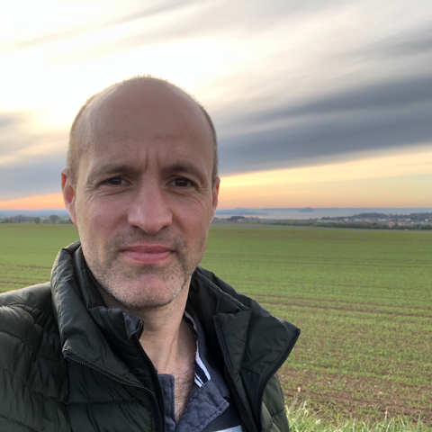
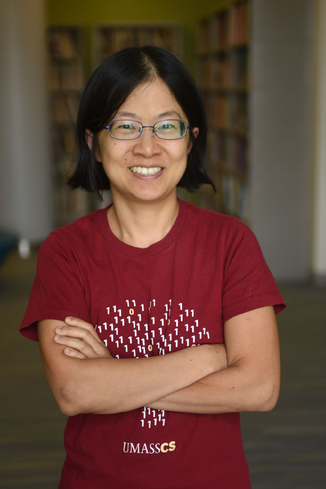

(Displayed in a random order every time)

- [**Kenny Smith (Edinburgh)**][smith]  
  **Title:**  Simplicity and expressivity in the evolution of linguistic systems  
  **Abstract:** 
  Language is a product of learning in individuals, and universal structural features of language presumably reflect properties of the way in which we learn. But language is not necessarily a direct reflection of properties of individual learners: languages are culturally-transmitted systems, which persist in populations via a repeated cycle of learning and use, where learners learn from linguistic data which represents the communicative behaviour of other individuals who learnt their language in the same way. Languages evolve as a result of this cycle of learning and use, and are therefore the product of a potentially complex interplay between the biases of human language learners, the communicative functions which language serves, and the ways in which languages are transmitted in populations. In this talk I will focus on the observation that natural languages appear to achieve a near-optimal tradeoff between simplicity (i.e. of the underlying grammatical system) and expressivity (their communicative utility); in several domains, natural languages seem to be the simplest of the highly expressive systems, and the most highly expressive of the simple systems. I’ll present a series of computational models and experiments with human participants showing how this tradeoff can be explained as a consequence of the cycle of learning and use by which natural languages persist, with learning and use imposing distinct pressures which jointly produce the observed simplicity-expressivity trade-off. I’ll end by discussing some recent work addressing more puzzling cases of apparently non-functional complexity, and whether these can be explained in the same framework.
    
  * Kenny Smith is based in the Centre for Language Evolution in the School of Philosophy, Psychology and Language Sciences at the University of Edinburgh. He uses computational and experimental methods to study the evolution of language and the human capacity for language. He is particularly interested in how languages are shaped by their repeated learning and use, and how this cultural evolutionary process in turn shapes the cognitive capacities underpinning language learning. He has an MA in Linguistics and Artificial Intelligence, an MSc in Cognitive Science, and a PhD in Linguistics, all from the University of Edinburgh. His first faculty position was in Psychology at Northumbria University in 2006. He returned to Edinburgh as a lecturer in 2010, and was promoted to professor in 2017. He is the Chair of the Cognitive Science Society (https://cognitivesciencesociety.org), and serves on the Executive Committee of the Cultural Evolution Society (https://culturalevolutionsociety.org/).

- [**Kristine Yu**][yu] 
  **Title:** Building Phonological Trees   
  **Abstract:**
  Computational perspectives from string grammars have richly informed our understanding of phonological patterns in natural language in the past decade. However, a prevailing theoretical assumption of phonologists since the 1980s has been that phonological patterns and processes are computed on trees built with prosodic constituents such as syllables, feet, and prosodic words. This talk explores how perspectives from tree grammars can provide insight into our understanding of prosodic representations, including different ways in which tones can enter the grammar.
  properties of inflectional paradigms as formal indicators (McWhorter, 2011, among others). However, several studies have shown that such approaches do not allow for principled ways of comparing the morphological complexities of languages with different morphological properties (e.g., Bonami and Henri, 2010). A decade ago, information-theoretic approaches were introduced, whose aim it was to take into account system-wide properties of inflectional systems (Blevins 2013). While some approaches chose to assess the overall informational content of morphological descriptions (Sagot and Walther, 2011), others studied the predictability of inflected forms based on other forms (Ackerman et al. 2009). Although these approaches are not incompatible – as we will discuss – we will also illustrate ways in which they are all subject to a number of limitations, some fatal (Sagot, 2018). Building on the newer information-theoretic approaches, more recent work has extended the question of purely formal morphological complexity to issues involving speaker-related complexity. Here, interest has shifted towards complexity in morphological processing and learning (Ackerman and Malouf, 2013). This work, which focuses on the relation between paradigm entropy and cognitive cost, has also been successfully complemented by experimental approaches that highlight how morphological systems are not learned and processed in isolation. They participate in an intricate linguistic system, where subsystem interactions are learned and drawn upon by speakers (Filipović Ðurđević and Milin, 2018). In return, we will also show how these system-wide interactions can be captured formally through observable cross-dependencies between morphological and syntactic patterns that challenge the boundaries traditionally drawn between morphology and other linguistic subfields.  
    
  * Kristine is an Associate Professor in the Department of Linguistics at University of Massachusetts Amherst. Her primary research interests are the production, computation, and processing of prosody, with a focus on tonal and intonational phenomena and interfaces. She integrates experimental and computational approaches and fieldwork, including work on African American English and Samoan.

- [**Reut Tsarfaty**][tsarfaty]  
  **Title:** More Than Morphs: Getting More Out of UniMorph  
  **Abstract:** Morphological processes such as inflection and reinflection are studied and evaluated in NLP nowadays with the help of UniMorph (UM), a large collection of labeled inflection tables of over a hundred topologically different languages.  In this talk we look closely at the current version of UniMorph and assess its design and content. Specifically, we ask whether UM is a necessary component of morphological reinflection (or would minimal supervision be enough),  whether the current version of UM is sufficient for morphological reinflection (or whether there are some aspects missing), and, importantly, whether the word forms in UM provide the right level of granularity for annotating morphology (as opposed to, for instance, phrase-level or clause-level). We derive answers to these questions from both theoretical arguments and empirical evidence, and conclude with concrete suggestions on steps that may be taken to push UM to the next level of studying computational morphology, in accord with contextualized embeddings and downstream tasks.
    
  * Reut Tsarfaty is Associate Professor at Bar-llan University, leading the Open Natural Language Processing research lab (The ONLP Lab). Her research focuses on natural language parsing broadly interpreted to cover morphological, syntactic and semantic phenomena, extended for the analysis of typologically different languages. She is a founder and instigator of the SPMRL community and shared tasks, a member of the UD steering committee, and as of recently, also a UniMorph enthusiast. Applications Reut has worked on include (but are not limited to) natural language programming, natural language navigation, automated essay scoring, analysis and generation of social media content, and more. Reut's research is funded by an ERC-Starting-Grant #677352 and an ISF grant #1739/26.

- [**Ekaterina Vylomova**][vylomova]  
  **Title:** The Secret Life of Words: Exploring Regularity and Systematicity  
  **Abstract:** To Come
    
  * Ekaterina Vylomova is a Postdoctoral Fellow at the University of Melbourne. Her research is focused on compositionality modelling for morphology, models of derivational morphology, linguistic typology, diachronic language models, and neural machine translation. She co-organized Typ-NLP2020 and helped with the SIGMORPHON 2017, 2018, 2019 shared tasks on morphological reinflection.

[smith]: https://www.research.ed.ac.uk/en/persons/kenny-smith
[tsarfaty]: https://www.openu.ac.il/en/personalsites/ReutTsarfaty.aspx
[yu]: https://www.umass.edu/linguistics/member/kristine-yu
[vylomova]: http://kat.academy/

